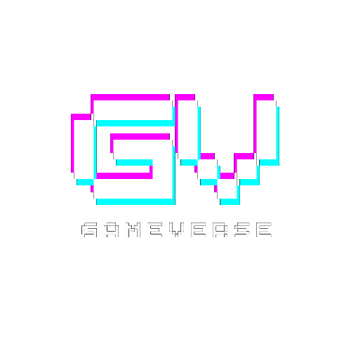

<p align="center">
  
</p>  

<p align="right">
  [BACKEND] 
</p>  

# 🎮 GameVerse 👥    
### *Il portale per gamer e sviluppatori di videogiochi*  
### *by Samuele Converso*    

---  

# 👋🏻 Benvenuto su **GameVerse**  

**GameVerse** è la piattaforma pensata per **videogiocatori** e **sviluppatori** che desiderano:

- Trovare nuove amicizie online 💬
- Condividere passioni e progetti legati al mondo videoludico 🎨
- Collaborare nella creazione di nuove **community** 🤝
- Scoprire e discutere nuovi videogiochi 🎲
- Costruire un network attivo tra chi gioca e chi crea giochi 👨‍💻👩‍💻  

---  

## 🌟 Obiettivi del Progetto

**GameVerse** nasce come progetto finale del ***corso full-time* da *Full-Stack Web Developer* di *Epicode*** con l’obiettivo di mettere in pratica e dimostrare nella pratica le competenze acquisite nel percorso.   

I principali obiettivi del portale sono:

- Offrire uno **spazio sociale digitale** per gamer e dev.
- Implementare una **Web API robusta e sicura**.
- Creare un’interfaccia **moderna, reattiva e user-friendly**.
- Gestire dati complessi come **post, commenti, amici, community, giochi e like**.
- Applicare **pattern professionali** per backend e frontend (Autenticazione, Routing, State Management).

---

## 🛠️ Tecnologie Utilizzate (backend & frontend)  

Il progetto è stato interamente realizzato in autonomia dal sottoscritto, Samuele Converso, sia lato **backend** che lato **frontend**, sfruttando un'architettura moderna **API + SPA**.

### 🔧 Backend (ASP.NET Core + SQL Server)

- **ASP.NET Core 8 Web API**  
  🔐 Gestione utenti con **Microsoft Identity**  
  🔄 API RESTful per gestione di utenti, post, commenti, videogiochi, community, amicizie e like.

- **Entity Framework Core (Code-First)**  
  🗃️ Modellazione del database relazionale con relazioni complesse  
  🔁 Migrazioni automatiche e gestione del ciclo di vita dei dati.

- **C#**  
  🧠 Sviluppato in C#, un linguaggio moderno e potente ideale per applicazioni web scalabili.

- **SQL Server & T-SQL in SSMS**  
  💾 Database relazionale ad alte prestazioni  
  🔐 Sicurezza, integrità e scalabilità.  
  🗒️ Query e gestione dei dati effettuate anche con T-SQL all’interno di SQL Server Management Studio.  
 
### 🌐 Frontend (React + Vite)

- **React** ⚛️  
  🔁 Interfaccia utente reattiva e component-based  
  🎨 UI dinamica, aggiornata in tempo reale.

- **Redux Toolkit** 🧠  
  📦 Gestione dello stato globale dell'app  
  🚀 Middleware personalizzati e slice modulari.

- **React Router DOM**  
  📍 Navigazione a pagina singola (SPA) con routing client-side.

- **Bootstrap 5** 🎨  
  🧩 Sistema di layout reattivo e accessibile  
  📱 Ottimizzato per mobile e desktop.

- **Vite** ⚡  
  🔥 Dev server rapidissimo con Fast Refresh grazie al plugin SWC: [@vitejs/plugin-react-swc](https://github.com/vitejs/vite-plugin-react/blob/main/packages/plugin-react-swc) usa [SWC](https://swc.rs/) per Fast Refresh  
  🛠️ Build moderna e ottimizzata.

- **JavaScript ES6+ / JSX**  
  📜 Logica interattiva, asincrona e reattiva  
  ✍️ Codice leggibile, manutenibile e modulare.

- **HTML5 & CSS3**  
  🧱 Struttura semantica e accessibile  
  🎨 Stili personalizzati e animazioni CSS.

---

## 🧩 Funzionalità Implementate

- 👤 **Registrazione e Login sicuri** con token JWT
- 🧑‍🤝‍🧑 **Sistema di amicizie**: invia, ricevi, accetta/rifiuta richieste
- 🧵 **Post e Commenti**: crea contenuti, partecipa alle discussioni
- 👍 **Like univoci** per post e commenti  
- 🕹️ **Gestione Videogiochi**: scopri, aggiungi e condividi giochi
- 🌐 **Community di gioco**: crea o entra in community tematiche

---

## 🚀 Altro & Come Avviare il Progetto in Locale

### ✅ Tool utilizzati durante lo sviluppo  

- [.NET 8 SDK](https://dotnet.microsoft.com/download)
- [SQL Server](https://www.microsoft.com/it-it/sql-server/sql-server-downloads)
- [SSMS](https://learn.microsoft.com/it-it/ssms/download-sql-server-management-studio-ssms)  
- [Node.js (v18+)](https://nodejs.org/)
- [Vite](https://vitejs.dev/)
- [Visual Studio](https://visualstudio.microsoft.com/it/) 
- [Visual Studio Code](https://code.visualstudio.com/)  
 
### 🔁 Clonazione del progetto

```bash
git clone https://github.com/SamueleConverso/capstone-project-backend
cd capstone-project-backend
```  

---

## 🔗 Link diretto alla repository **frontend**  

👉🏻 [Frontend](https://github.com/SamueleConverso/capstone-project)  

---  

## 📬 Contatti

📫 Sentiti libero di contattarmi per collaborazioni, offerte di lavoro o anche solo per fare networking!

- 💼 [LinkedIn](https://www.linkedin.com/in/samuele-converso-b13999326/)
- 📨 **Email**: samu.converso@gmail.com
- 🐙 [GitHub](https://github.com/SamueleConverso)
- 👽 **Discord**: superlelex


